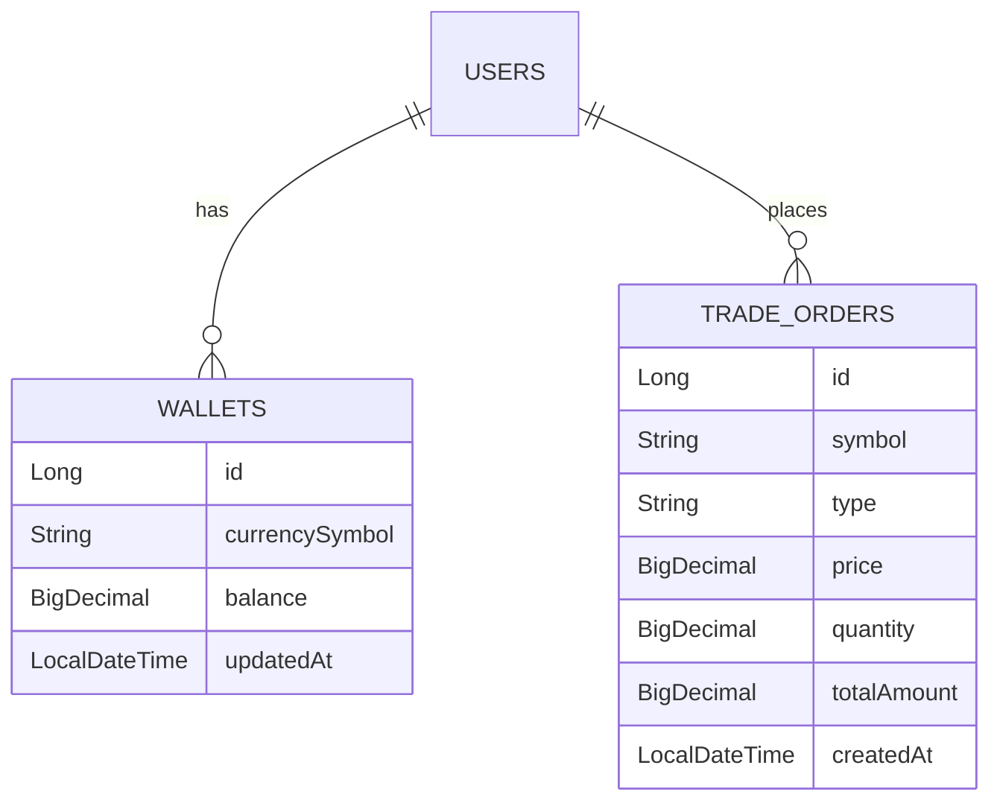

# 🚀 Crypto Paper Trading System (Backend API)

> Hệ thống giả lập giao dịch tiền điện tử thời gian thực, xây dựng theo kiến trúc Modular Monolithic với Spring Boot 3 & PostgreSQL.

## 📖 Giới thiệu (Introduction)
Dự án này là hệ thống Backend cung cấp API cho nền tảng **"Paper Trading"** (Giao dịch trên giấy). Nó cho phép người dùng thực hành đầu tư tiền điện tử với dữ liệu thị trường thực tế (Real-time Market Data) mà không gặp rủi ro tài chính.

Người dùng được cấp **10,000 USDT ảo** ban đầu để mua/bán các đồng coin (Bitcoin, Ethereum, etc.). Hệ thống tính toán lãi/lỗ và tổng tài sản dựa trên biến động giá thực tế từ **CoinGecko API**.

## 🛠 Tech Stack & Tools

| Category | Technology |
|----------|------------|
| **Core Framework** | Spring Boot 3.x, Java 17 |
| **Database** | PostgreSQL |
| **Security** | Spring Security 6, JWT (Stateless Authentication) |
| **Build Tool** | Maven |
| **API Documentation** | OpenAPI 3 (Swagger UI) |
| **External API** | CoinGecko (via RestTemplate) |
| **Architecture** | Modular Monolithic, Facade Pattern |
| **Version Control** | Git & Github |

## 🏗 Kiến trúc hệ thống (Architecture)

Dự án tuân thủ chặt chẽ các nguyên tắc **Clean Architecture** và **SOLID**:

* **Modular Monolithic:** Chia tách rõ ràng các module (Wallet, Trading, Market Data).
* **Facade Pattern:** Sử dụng `MarketService` làm Facade để che giấu sự phức tạp khi gọi External API (CoinGecko), giúp dễ dàng bảo trì và thay thế nguồn dữ liệu.
* **DTO Pattern:** Sử dụng Request/Response DTO cho mọi API, đảm bảo không expose trực tiếp Entity ra ngoài.
* **ACID Transaction:** Đảm bảo tính nhất quán dữ liệu trong các giao dịch tài chính (Rollback nếu có lỗi xảy ra).

### Database Schema (Simplified)



[//]: # ()
[//]: # (### Phần 4: Các tính năng chính &#40;Key Features&#41;)

[//]: # (*Mô tả chi tiết những gì bạn đã làm được trong các Phase.*)

[//]: # (```markdown)
## ✨ Tính năng chính (Key Features)

### 1. Authentication & Authorization
* Đăng ký tài khoản mới.
* Đăng nhập lấy **JWT Token**.
* Bảo mật endpoint bằng Spring Security Filter Chain.

### 2. Wallet Management (Ví tài sản)
* Tự động khởi tạo ví demo **10,000 USDT** cho user mới.
* Hỗ trợ đa tiền tệ (Multi-currency balance).
* Logic kiểm soát chặt chẽ: Chặn số dư âm, xử lý độ chính xác số thực (`BigDecimal`).

### 3. Trading Core (Giao dịch)
* Đặt lệnh Mua (Buy) và Bán (Sell) theo giá thị trường (Market Order).
* **Real-time Price:** Lấy giá thực tế từ CoinGecko tại thời điểm khớp lệnh.
* Lưu trữ lịch sử giao dịch đầy đủ, hỗ trợ phân trang (Pagination).

### 4. Portfolio & Analytics (Danh mục đầu tư)
* **Real-time Net Worth:** Tính toán tổng tài sản ròng dựa trên giá thị trường hiện tại.
* API trả về danh sách tài sản chi tiết: Số lượng coin * Giá hiện tại = Tổng giá trị.

## 🚀 Cài đặt & Chạy dự án (Installation)

### Yêu cầu (Prerequisites)
* Java 17 JDK
* Maven 3.x
* PostgreSQL Database

### Các bước thực hiện

1.  **Clone repository:**
    ```bash
    git clone https://github.com/pisee-it/paper-trading-be-2025.git
    ```

2.  **Cấu hình Database:**
    * Tạo database tên `crypto_trading_db` hoặc bất cứ một tên database nào đó giúp gợi nhớ trong PostgreSQL.
    * Cập nhật file `src/main/resources/application.properties`:
        ```properties
        spring.datasource.url=jdbc:postgresql://localhost:5432/crypto_trading_db
        spring.datasource.username=postgres
        spring.datasource.password=your_password
        
        # Hibernate ddl-auto (Update for dev, Validate for prod)
        spring.jpa.hibernate.ddl-auto=update
        ```

3.  **Chạy ứng dụng:**
    ```bash
    mvn spring-boot:run
    ```

4.  **Truy cập Swagger UI (API Docs):**
    * Mở trình duyệt: `http://localhost:8080/swagger-ui/index.html`
    * Sử dụng Swagger để test API trực quan.

## 🧪 Testing

Dự án bao gồm Unit Test cho các service quan trọng (WalletService, TradingService).

```bash
# Chạy toàn bộ test case
mvn test
```

## 👨‍💻 Tác giả (Author)

**Dương Phú Cường (PiSee)**
* **Role:** Backend Developer (Java/Spring Boot)
* **Email:** piseeit@gmail.com
* **GitHub:** https://github.com/pisee-it


*Project developed for Internship Application Portfolio (2025).*